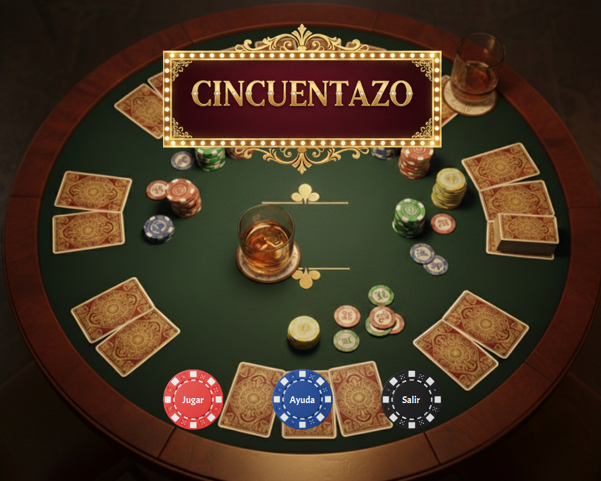
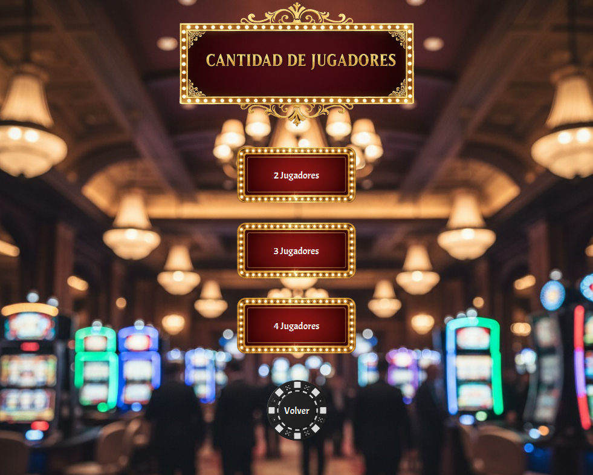
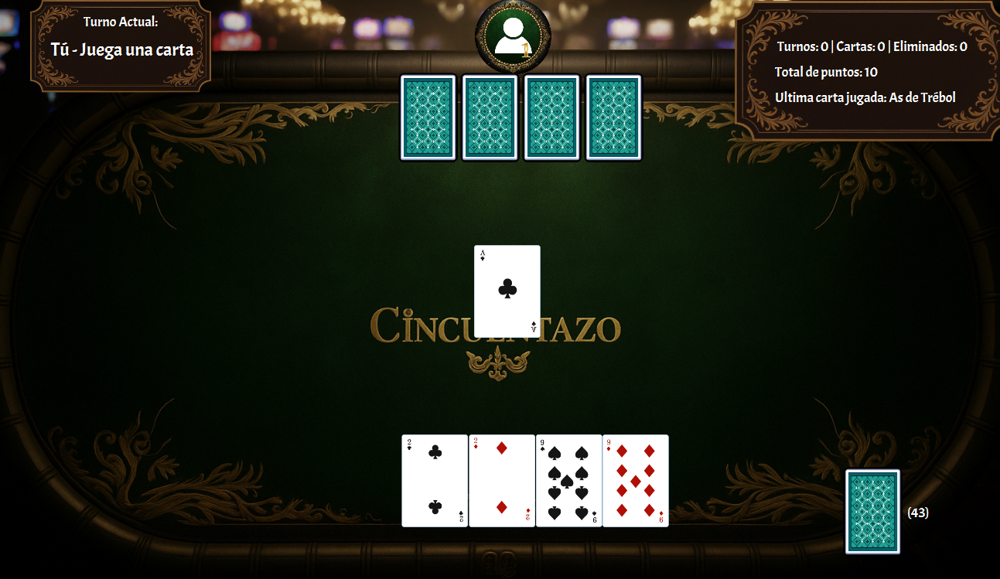
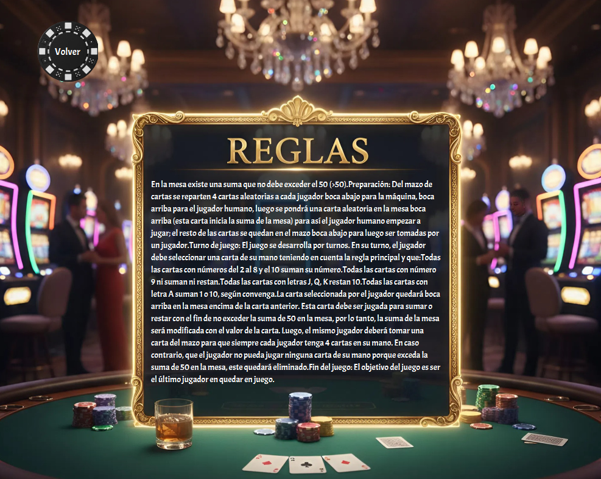
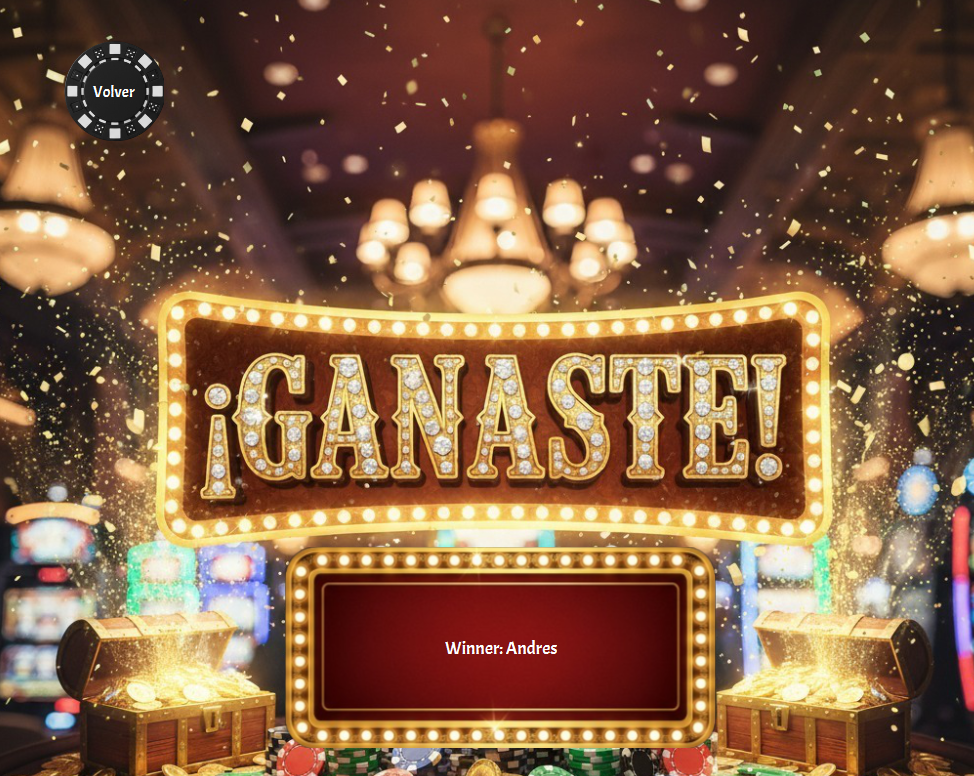

# 🎮 Cincuentazo

<div align="center">
  
  
  [](https://github.com/usuario/sudoku-aventura-tinta/releases/tag/v1.0.0)
  [](https://www.oracle.com/java/)
  [](https://openjfx.io/)
</div>

---

## 📖 Descripción General

**Cincuentazo** es un juego de cartas desarrollado como el Miniproyecto #3 para el curso de Fundamentos de Programación Orientada a Eventos (FPOE). Implementado en Java 17 con JavaFX y estructurado bajo la arquitectura Modelo–Vista–Controlador (MVC), el proyecto integra programación orientada a eventos, manejo de hilos, excepciones personalizadas y pruebas unitarias con JUnit 5.

En Cincuentazo, varios jugadores (humano y hasta tres máquinas) compiten por mantener la suma en mesa lo más cercana posible a 50 sin excederla. El sistema reparte las cartas automáticamente, gestiona turnos (con temporizadores para jugadores máquina), valida jugadas según las reglas del juego (valores de cartas numéricas, J/Q/K = −10, A = 1 o 10, 9 = 0), recicla el mazo cuando se agota y elimina jugadores que no pueden jugar. El diseño del código busca claridad, modularidad y facilidad de mantenimiento, cumpliendo los requisitos académicos de usabilidad, documentación (Javadoc) y control de versiones.

---

## ✨ Características Principales

🎨 Interfaz gráfica completa en JavaFX usando FXML y componentes personalizados.

🧠 Lógica completa del juego Cincuentazo, incluyendo reglas, valores especiales de cartas y validación de jugadas.

🔁 Turnos automáticos de los jugadores máquina, implementados con hilos y pausas temporales configuradas.

♻️ Reciclaje automático del mazo cuando se quedan sin cartas.

🃏 Sistema de reparto inicial y toma de cartas según la mecánica del juego.

⚠️ Manejo avanzado de excepciones, incluyendo una excepción personalizada para errores del juego.

🛠️ Uso de clases internas, abstractas e interfaces para cumplir lineamientos del proyecto y mantener una arquitectura sólida.

🧩 Arquitectura MVC que separa la lógica, la interfaz y los controladores.

🧪 Pruebas unitarias con JUnit 5, cubriendo funcionalidad de modelos clave.

🎵 Pantallas modulares para menú, juego y opciones, con navegación fluida.

---

## 🛠️ Tecnologías y Herramientas

### Lenguajes y Frameworks
☕ Java SE 17 — lenguaje principal del proyecto.

🖼️ JavaFX 20+ — creación de la interfaz gráfica.

📄 FXML — definición estructurada de vistas y componentes UI.

🔧 CSS — estilos personalizados para las interfaces.

🧪 JUnit 5 — framework para pruebas unitarias.

### Herramientas de Desarrollo
💻 IntelliJ IDEA — IDE principal del desarrollo.

🧱 Scene Builder — diseño visual de interfaces FXML.

⚙️ Maven — gestión de dependencias y construcción del proyecto.

🔗 Git — control de versiones distribuido.

🐙 GitHub — repositorio remoto, colaboración y Pull Requests.

### Documentación
📘 Javadoc — generación automática de documentación del código.

📝 Markdown — documentación del proyecto (README y archivos auxiliares).

---

## 📁 Estructura del Proyecto
```
Miniproyecto_3/
│
├── src/
│   ├── main/
│   │   ├── java/com/example/proyecto3_/
│   │   │   ├── controller/
│   │   │   │   ├── GameController.java
│   │   │   │   ├── HelpController.java
│   │   │   │   ├── MenuController.java
│   │   │   │   ├── OptionsController.java
│   │   │   │   └── WinController.java
│   │   │   │
│   │   │   ├── model/
│   │   │   │   ├── Cards/
│   │   │   │   │   ├── AbstractCard.java
│   │   │   │   │   ├── Card.java
│   │   │   │   │   └── ICard.java
│   │   │   │   ├── Deck/
│   │   │   │   │   ├── AbstractDeck.java
│   │   │   │   │   ├── Deck.java
│   │   │   │   │   └── IDeck.java
│   │   │   │   ├── Exceptions/
│   │   │   │   │   ├── DeckEmptyException.java
│   │   │   │   │   ├── InvalidGameStateException.java
│   │   │   │   │   ├── InvalidMoveException.java
│   │   │   │   │   └── NoValidCardException.java
│   │   │   │   ├── Game/
│   │   │   │   │   ├── GameConfig.java
│   │   │   │   │   └── GameModel.java
│   │   │   │   └── Player/
│   │   │   │       ├── AbstractPlayer.java
│   │   │   │       ├── IPlayer.java
│   │   │   │       └── Player.java
│   │   │   │
│   │   │   ├── view/
│   │   │   │   ├── Game.java
│   │   │   │   ├── Help.java
│   │   │   │   ├── Menu.java
│   │   │   │   ├── Options.java
│   │   │   │   └── Win.java
│   │   │   │
│   │   │   └── Main.java
│   │   │
│   │   └── resources/com/example/proyecto3_/
│   │       ├── Css/
│   │       │   └── Styles.css
│   │       ├── Font/
│   │       │   ├── Acme-Regular.ttf
│   │       │   └── OFL.txt
│   │       ├── Img/
│   │       │   └── img_readme/
│   │       │       ├── 1.png
│   │       │       ├── 2.png
│   │       │       ├── 3.png
│   │       │       ├── 4.png
│   │       │       └── 5.png
│   │       ├── Game-view.fxml
│   │       ├── Menu-view.fxml
│   │       ├── Options-view.fxml
│   │       ├── Rules-view.fxml
│   │       └── Win-view.fxml
│   │
│   └── test/java/com/example/proyecto3_.model/
│       ├── Cards/
│       │   └── CardTest.java
│       ├── Deck/
│       │   └── DeckTest.java
│       └── Player/
│           └── PlayerTest.java
│
├── .gitignore
├── pom.xml
└── README.md
```

### 📦 Descripción de Paquetes

#### **Controller**
Controladores JavaFX que manejan la lógica de las vistas:
- `GameController`: Lógica del tablero de juego y manejo de turnos
- `HelpController`: Controlador de la pantalla de ayuda/reglas
- `MenuController`: Controlador del menú de bienvenida
- `OptionsController`: Controlador de opciones del juego
- `WinController`: Controlador de la pantalla de victoria

#### **Model**
Capa de modelo con la lógica de negocio:
- **Cards/**: Sistema de cartas
  - `AbstractCard`: Clase abstracta base para cartas
  - `Card`: Implementación de carta
  - `ICard`: Interfaz de carta
- **Deck/**: Gestión del mazo
  - `AbstractDeck`: Clase abstracta del mazo
  - `Deck`: Implementación del mazo (mezclar, repartir, reciclar)
  - `IDeck`: Interfaz del mazo
- **Exceptions/**: Manejo de excepciones personalizadas
  - `DeckEmptyException`: Excepción no marcada para mazo vacío
  - `InvalidGameStateException`: Excepción marcada para estado inválido
  - `InvalidMoveException`: Excepción marcada para jugada inválida
  - `NoValidCardException`: Excepción marcada para carta no válida
- **Game/**: Lógica del juego
  - `GameConfig`: Configuración del juego
  - `GameModel`: Modelo principal del juego
- **Player/**: Gestión de jugadores
  - `AbstractPlayer`: Clase abstracta base para jugadores
  - `IPlayer`: Interfaz de jugador
  - `Player`: Implementación de jugador (humano y máquina con IA)

#### **View**
Clases de visualización y gestión de escenas:
- `Game`: Ventana del juego
- `Help`: Ventana de ayuda
- `Menu`: Ventana de bienvenida
- `Options`: Ventana de opciones
- `Win`: Ventana de victoria

#### **Resources**
Recursos de la aplicación:
- **Css/**: Hojas de estilo para la interfaz
  - `Styles.css`: Estilos personalizados del juego
- **Font/**: Fuentes tipográficas
  - `Acme-Regular.ttf`: Fuente principal
- **Img/**: Imágenes y recursos gráficos
  - `img_readme/`: Capturas de pantalla para documentación
- **FXML**: Archivos de diseño de interfaz
  - `Game-view.fxml`: Diseño del tablero de juego
  - `Menu-view.fxml`: Diseño del menú principal
  - `Options-view.fxml`: Diseño de opciones
  - `Rules-view.fxml`: Diseño de las reglas
  - `Win-view.fxml`: Diseño de la pantalla de victoria

#### **Test**
Pruebas unitarias con JUnit 5:
- **Cards/**: `CardTest` - Pruebas de cartas
- **Deck/**: `DeckTest` - Pruebas del mazo
- **Player/**: `PlayerTest` - Pruebas de jugadores


## 🚀 Instalación y Ejecución

### Prerrequisitos

Antes de comenzar, asegúrate de tener instalado:

☕ Java JDK 17 o superior — requerido para compilar y ejecutar el proyecto.

⚙️ Maven 3.6+ — para gestionar dependencias y construir el proyecto.

🔗 Git — para clonar, actualizar y manejar el repositorio.

💻 IntelliJ IDEA (recomendado) — IDE principal para el desarrollo.

🖼️ **Herramientas adicionales**

🧱 Scene Builder — para editar y visualizar archivos FXML.

### Verificar Instalaciones

```bash
java -version    # Debe mostrar Java 17+
mvn -version     # Debe mostrar Maven 3.6+
git --version    # Debe mostrar versión de Git
```

### Instalación

#### 1️⃣ Clonar el Repositorio

```bash
git clone https://github.com/juancamilor1707/Miniproyecto_3.git
cd Miniproyecto_3
```

#### 2️⃣ Compilar con Maven

```bash
mvn clean install
```

#### 3️⃣ Ejecutar

**Opción A: Maven**
```bash
mvn javafx:run
```

**Opción B: IntelliJ IDEA**
1. Abre el proyecto
2. Ejecuta `Main.java`

**Ejecutar Pruebas**
```bash
mvn test
```

---


## 🎮 Cómo Jugar

1.Inicia la aplicación desde el menú principal del proyecto.

2.El sistema reparte las cartas automáticamente a todos los jugadores.

3.En tu turno, podrás ver tu mano, revisar la suma actual y decidir tu jugada.

4.El objetivo es acercarse lo más posible a 50 puntos sin pasarse.

5.Las cartas tienen valores especiales según las reglas del Cincuentazo:

*Números del 2 al 10 conservan su valor

*A = 1 o 10 (según convenga)

*J, Q, K = −10

*9 = 0

6.Los jugadores máquina realizan sus turnos automáticamente, usando hilos que simulan tiempos de espera para mayor realismo.

7.Si un jugador supera 50 puntos, queda eliminado del juego.

8.Cuando se acaban las cartas, el mazo se recicla automáticamente con las cartas descartadas.

9.El juego continúa hasta que quede un solo jugador o hasta determinar quién quedó más cerca de 50 sin excederlo.

10.Al final se muestra la pantalla de resultados con el ganador de la partida.

---

## 🔄 Uso de Git y Control de Versiones

### Flujo de Trabajo con Git

Este proyecto sigue un flujo de trabajo estructurado utilizando Git y GitHub para el control de versiones.

#### Configuración Inicial
```bash
# Configurar usuario de Git
git config --global user.name "Tu Nombre"
git config --global user.email "tu.email@ejemplo.com"

# Clonar el repositorio
git clone https://github.com/usuario/sudoku-aventura-tinta.git
cd sudoku-aventura-tinta
```

#### Estructura de Ramas

- **`main`**: Código estable
- **`Logic`**: Lógica del juego
- **`Visuals`**: Interfaz gráfica
- **`unit-tests`**: Pruebas unitarias

### Historial de Versiones

| Versión | Fecha | Descripción |
|---------|-------|-------------|
| v1.0.0 | 12/11/2025 | Lanzamiento inicial con todas las características principales |

---

## 📸 Capturas de Pantalla

### Menú Principal


### Elecion de participantes


### Mesa de Juego


### Selección de Reglas


### Juego Completado



---


---

## 👥 Autores

Este proyecto fue desarrollado por:

- **Andres Felipe Muñoz Moreno** - Desarrollador
- **Juan Manuel Muñoz Delgado** - Desarrollador
- **Juan Camilo Hoyos Ramos** - Desarrollador


## 📞 Contacto

- 📧 Email: andres.f.munoz.m@correounivalle.edu.co | juan.munoz.delgado@correounivalle.edu.co | Juan.ramos.hoyos@correounivalle.edu.co
- 🐙 GitHub: [@juanmunozdelgado-oss]([https://github.com/usuario1](https://github.com/juanmunozdelgado-oss)) | [@AndresMunozMoreno
](https://github.com/AndresMunozMoreno) | [@juancamilor1707](https://github.com/juancamilor1707)
- 🌐 Website del Proyecto: [https://Cincuentazo.io](https://github.com/juancamilor1707/Miniproyecto_3)

---

<div align="center">
  <p>Hecho con ❤️ y ☕ por Andres Felipe Muñoz Moreno y Juan Manuel Muñoz Delgado y Juan Camilo Ramos Hoyos</p>
  <p>© 2025 Cincuentazo - Versión 1.0.0</p>
  
</div>
